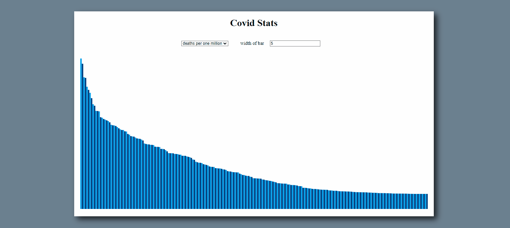
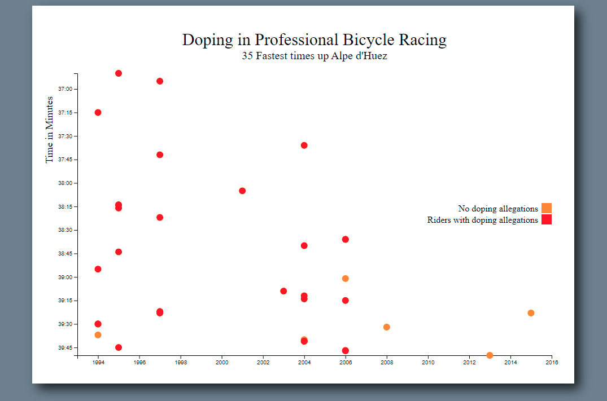
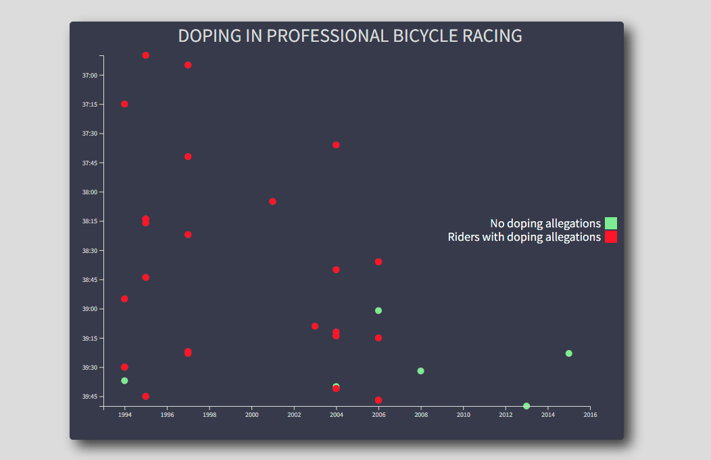
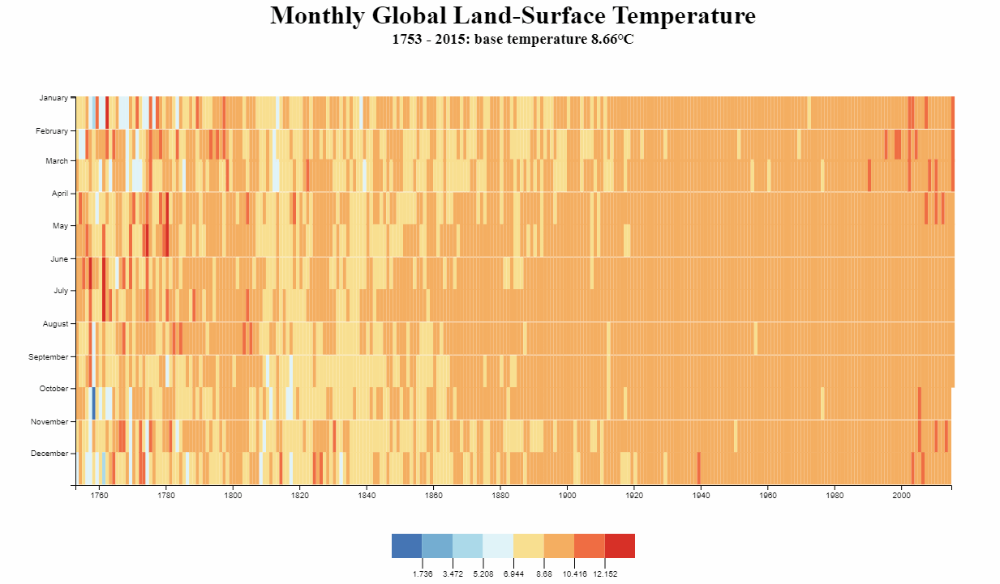
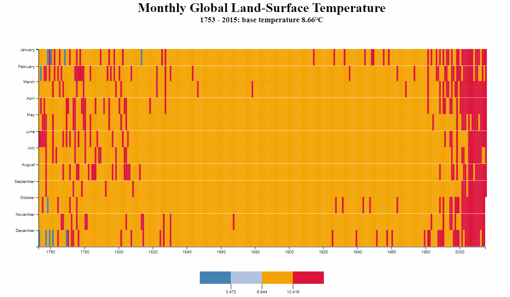
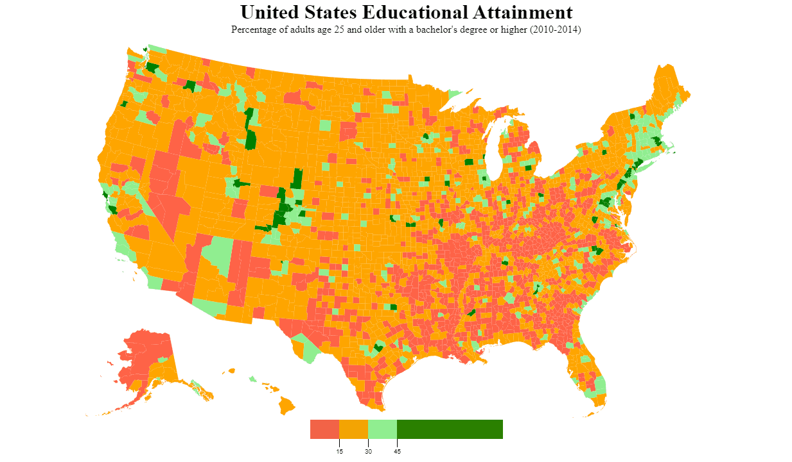
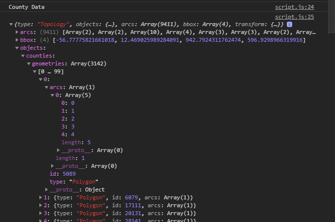
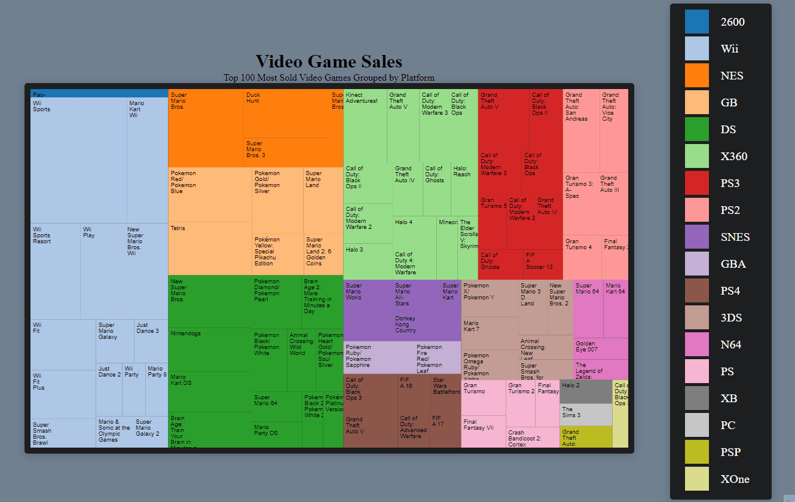

# 🚀 Freecodecamp certification : Data Visualization 🚀
online course : https://www.freecodecamp.org/learn/data-visualization/


## Stacks :
<div align="center">


</div>

* [D3.js](https://d3js.org/)
* [React](https://fr.reactjs.org/)
* consume data ([fetch](https://developer.mozilla.org/fr/docs/Web/API/Fetch_API), [XMLHttpRequest](https://developer.mozilla.org/fr/docs/Web/API/XMLHttpRequest), [d3.json](https://www.tutorialsteacher.com/d3js/loading-data-from-file-in-d3js))
* [async/await](https://developer.mozilla.org/fr/docs/Web/JavaScript/Reference/Statements/async_function) & [promise](https://developer.mozilla.org/fr/docs/Web/JavaScript/Reference/Global_Objects/Promise)
* [svg](https://developer.mozilla.org/fr/docs/Web/SVG)
* html
* css
* javascript
* ...


## __Summary :__


<details>
<summary><CODE>Data Visualization with D3</CODE></summary>

* [Add Document Elements with D3](./1_Data-Visualization-with-D3/1_Add-Document-Elements-with-D3) > [code](./1_Data-Visualization-with-D3/1_Add-Document-Elements-with-D3/freecodecamps.html)  |  [readme](./1_Data-Visualization-with-D3/1_Add-Document-Elements-with-D3/README.md)
* [Select a Group of Elements with D3](./1_Data-Visualization-with-D3/2_Select-a-Group-of-Elements-with-D3) > [code](./1_Data-Visualization-with-D3/2_Select-a-Group-of-Elements-with-D3/freecodecamps.html)  |  [readme](./1_Data-Visualization-with-D3/2_Select-a-Group-of-Elements-with-D3/README.md)
* [Work with Data in D3](./1_Data-Visualization-with-D3/3_Work-with-Data-in-D3) > [code](./1_Data-Visualization-with-D3/3_Work-with-Data-in-D3/freecodecamps.html)  |  [readme](./1_Data-Visualization-with-D3/3_Work-with-Data-in-D3/README.md)
* [Work with Dynamic Data in D3](./1_Data-Visualization-with-D3/4_Work-with-Dynamic-Data-in-D3) > [code](./1_Data-Visualization-with-D3/4_Work-with-Dynamic-Data-in-D3/freecodecamps.html)  |  [readme](./1_Data-Visualization-with-D3/4_Work-with-Dynamic-Data-in-D3/README.md)
* [Add Inline Styling to Elements](./1_Data-Visualization-with-D3/5_Add-Inline-Styling-to-Elements) > [code](./1_Data-Visualization-with-D3/5_Add-Inline-Styling-to-Elements/freecodecamps.html)  |  [readme](./1_Data-Visualization-with-D3/5_Add-Inline-Styling-to-Elements/README.md)
* [Change Styles Based on Data](./1_Data-Visualization-with-D3/6_Change-Styles-Based-on-Data) > [code](./1_Data-Visualization-with-D3/6_Change-Styles-Based-on-Data/freecodecamps.html)  |  [readme](./1_Data-Visualization-with-D3/6_Change-Styles-Based-on-Data/README.md)
* [Add Classes with D3](./1_Data-Visualization-with-D3/7_Add-Classes-with-D3) > [code](./1_Data-Visualization-with-D3/7_Add-Classes-with-D3/freecodecamps.html)  |  [readme](./1_Data-Visualization-with-D3/7_Add-Classes-with-D3/README.md)
* [Update the Height of an Element Dynamically](./1_Data-Visualization-with-D3/8_Update-the-Height-of-an-Element-Dynamically) > [code](./1_Data-Visualization-with-D3/8_Update-the-Height-of-an-Element-Dynamically/freecodecamps.html)  |  [readme](./1_Data-Visualization-with-D3/8_Update-the-Height-of-an-Element-Dynamically/README.md)
* [Change the Presentation of a Bar Chart](./1_Data-Visualization-with-D3/9_Change-the-Presentation-of-a-Bar-Chart) > [code](./1_Data-Visualization-with-D3/9_Change-the-Presentation-of-a-Bar-Chart/freecodecamps.html)  |  [readme](./1_Data-Visualization-with-D3/9_Change-the-Presentation-of-a-Bar-Chart/README.md)
* [Learn About SVG in D3](./1_Data-Visualization-with-D3/10_Learn-About-SVG-in-D3) > [code](./1_Data-Visualization-with-D3/10_Learn-About-SVG-in-D3/freecodecamps.html)  |  [readme](./1_Data-Visualization-with-D3/10_Learn-About-SVG-in-D3/README.md)
* [Display Shapes with SVG](./1_Data-Visualization-with-D3/11_Display-Shapes-with-SVG) > [code](./1_Data-Visualization-with-D3/11_Display-Shapes-with-SVG/freecodecamps.html)  |  [readme](./1_Data-Visualization-with-D3/11_Display-Shapes-with-SVG/README.md)
* [Create a Bar for Each Data Point in the Set](./1_Data-Visualization-with-D3/12_Create-a-Bar-for-Each-Data-Point-in-the-Set) > [code](./1_Data-Visualization-with-D3/12_Create-a-Bar-for-Each-Data-Point-in-the-Set/freecodecamps.html)  |  [readme](./1_Data-Visualization-with-D3/12_Create-a-Bar-for-Each-Data-Point-in-the-Set/README.md)
* [Dynamically Set the Coordinates for Each Bar](./1_Data-Visualization-with-D3/13_Dynamically-Set-the-Coordinates-for-Each-Bar) > [code](./1_Data-Visualization-with-D3/13_Dynamically-Set-the-Coordinates-for-Each-Bar/freecodecamps.html)  |  [readme](./1_Data-Visualization-with-D3/13_Dynamically-Set-the-Coordinates-for-Each-Bar/README.md)
* [Dynamically Change the Height of Each Bar](./1_Data-Visualization-with-D3/14_Dynamically-Change-the-Height-of-Each-Bar) > [code](./1_Data-Visualization-with-D3/14_Dynamically-Change-the-Height-of-Each-Bar/freecodecamps.html)  |  [readme](./1_Data-Visualization-with-D3/14_Dynamically-Change-the-Height-of-Each-Bar/README.md)
* [Invert SVG Elements](./1_Data-Visualization-with-D3/15_Invert-SVG-Elements) > [code](./1_Data-Visualization-with-D3/15_Invert-SVG-Elements/freecodecamps.html)  |  [readme](./1_Data-Visualization-with-D3/15_Invert-SVG-Elements/README.md)
* [Change the Color of an SVG Element](./1_Data-Visualization-with-D3/16_Change-the-Color-of-an-SVG-Element) > [code](./1_Data-Visualization-with-D3/16_Change-the-Color-of-an-SVG-Element/freecodecamps.html)  |  [readme](./1_Data-Visualization-with-D3/16_Change-the-Color-of-an-SVG-Element/README.md)
* [Add Labels to D3 Elements](./1_Data-Visualization-with-D3/17_Add-Labels-to-D3-Elements) > [code](./1_Data-Visualization-with-D3/17_Add-Labels-to-D3-Elements/freecodecamps.html)  |  [readme](./1_Data-Visualization-with-D3/17_Add-Labels-to-D3-Elements/README.md)
* [Style D3 Labels](./1_Data-Visualization-with-D3/18_Style-D3-Labels) > [code](./1_Data-Visualization-with-D3/18_Style-D3-Labels/freecodecamps.html)  |  [readme](./1_Data-Visualization-with-D3/18_Style-D3-Labels/README.md)
* [Add a Hover Effect to a D3 Element](./1_Data-Visualization-with-D3/19_Add-a-Hover-Effect-to-a-D3-Element) > [code](./1_Data-Visualization-with-D3/19_Add-a-Hover-Effect-to-a-D3-Element/freecodecamps.html)  |  [readme](./1_Data-Visualization-with-D3/19_Add-a-Hover-Effect-to-a-D3-Element/README.md)
* [Add a Tooltip to a D3 Element](./1_Data-Visualization-with-D3/20_Add-a-Tooltip-to-a-D3-Element) > [code](./1_Data-Visualization-with-D3/20_Add-a-Tooltip-to-a-D3-Element/freecodecamps.html)  |  [readme](./1_Data-Visualization-with-D3/20_Add-a-Tooltip-to-a-D3-Element/README.md)
* [Create a Scatterplot with SVG Circles](./1_Data-Visualization-with-D3/21_Create-a-Scatterplot-with-SVG-Circles) > [code](./1_Data-Visualization-with-D3/21_Create-a-Scatterplot-with-SVG-Circles/freecodecamps.html)  |  [readme](./1_Data-Visualization-with-D3/21_Create-a-Scatterplot-with-SVG-Circles/README.md)
* [Add Attributes to the Circle Elements](./1_Data-Visualization-with-D3/22_Add-Attributes-to-the-Circle-Elements) > [code](./1_Data-Visualization-with-D3/22_Add-Attributes-to-the-Circle-Elements/freecodecamps.html)  |  [readme](./1_Data-Visualization-with-D3/22_Add-Attributes-to-the-Circle-Elements/README.md)
* [Add Labels to Scatter Plot Circles](./1_Data-Visualization-with-D3/23_Add-Labels-to-Scatter-Plot-Circles) > [code](./1_Data-Visualization-with-D3/23_Add-Labels-to-Scatter-Plot-Circles/freecodecamps.html)  |  [readme](./1_Data-Visualization-with-D3/23_Add-Labels-to-Scatter-Plot-Circles/README.md)
* [Create a Linear Scale with D3](./1_Data-Visualization-with-D3/24_Create-a-Linear-Scale-with-D3) > [code](./1_Data-Visualization-with-D3/24_Create-a-Linear-Scale-with-D3/freecodecamps.html)  |  [readme](./1_Data-Visualization-with-D3/24_Create-a-Linear-Scale-with-D3/README.md)
* [Set a Domain and a Range on a Scale](./1_Data-Visualization-with-D3/25_Set-a-Domain-and-a-Range-on-a-Scale) > [code](./1_Data-Visualization-with-D3/25_Set-a-Domain-and-a-Range-on-a-Scale/freecodecamps.html)  |  [readme](./1_Data-Visualization-with-D3/25_Set-a-Domain-and-a-Range-on-a-Scale/README.md)
* [Use the d3 max and d3 min Functions to Find Minimum and Maximum Values in a Dataset](./1_Data-Visualization-with-D3/26_Use-the-d3-max-and-d3-min-Functions-to-Find-Minimum-and-Maximum-Values-in-a-Dataset) > [code](./1_Data-Visualization-with-D3/26_Use-the-d3-max-and-d3-min-Functions-to-Find-Minimum-and-Maximum-Values-in-a-Dataset/freecodecamps.html)  |  [readme](./1_Data-Visualization-with-D3/26_Use-the-d3-max-and-d3-min-Functions-to-Find-Minimum-and-Maximum-Values-in-a-Dataset/README.md)
* [Use Dynamic Scales](./1_Data-Visualization-with-D3/27_Use-Dynamic-Scales) > [code](./1_Data-Visualization-with-D3/27_Use-Dynamic-Scales/freecodecamps.html)  |  [readme](./1_Data-Visualization-with-D3/27_Use-Dynamic-Scales/README.md)
* [Use a Pre Defined Scale to Place Elements](./1_Data-Visualization-with-D3/28_Use-a-Pre-Defined-Scale-to-Place-Elements) > [code](./1_Data-Visualization-with-D3/28_Use-a-Pre-Defined-Scale-to-Place-Elements/freecodecamps.html)  |  [readme](./1_Data-Visualization-with-D3/28_Use-a-Pre-Defined-Scale-to-Place-Elements/README.md)
* [Add Axes to a Visualization](./1_Data-Visualization-with-D3/29_Add-Axes-to-a-Visualization) > [code](./1_Data-Visualization-with-D3/29_Add-Axes-to-a-Visualization/freecodecamps.html)  |  [readme](./1_Data-Visualization-with-D3/29_Add-Axes-to-a-Visualization/README.md)

</details>

<details>
<summary><CODE>JSON APIs and AJAX</CODE></summary>

* [Handle Click Events with JavaScript using the onclick property](./2_JSON-APIs-and-AJAX/1_Handle-Click-Events-with-JavaScript-using-the-onclick-property) > [code](./2_JSON-APIs-and-AJAX/1_Handle-Click-Events-with-JavaScript-using-the-onclick-property/freecodecamps.html)  |  [readme](./2_JSON-APIs-and-AJAX/1_Handle-Click-Events-with-JavaScript-using-the-onclick-property/README.md)
* [Change Text with click Events](./2_JSON-APIs-and-AJAX/2_Change-Text-with-click-Events) > [code](./2_JSON-APIs-and-AJAX/2_Change-Text-with-click-Events/freecodecamps.html)  |  [readme](./2_JSON-APIs-and-AJAX/2_Change-Text-with-click-Events/README.md)
* [Get JSON with the JavaScript XMLHttpRequest Method](./2_JSON-APIs-and-AJAX/3_Get-JSON-with-the-JavaScript-XMLHttpRequest-Method) > [code](./2_JSON-APIs-and-AJAX/3_Get-JSON-with-the-JavaScript-XMLHttpRequest-Method/freecodecamps.html)  |  [readme](./2_JSON-APIs-and-AJAX/3_Get-JSON-with-the-JavaScript-XMLHttpRequest-Method/README.md)
* [Get JSON with the JavaScript fetch method](./2_JSON-APIs-and-AJAX/4_Get-JSON-with-the-JavaScript-fetch-method) > [code](./2_JSON-APIs-and-AJAX/4_Get-JSON-with-the-JavaScript-fetch-method/freecodecamps.html)  |  [readme](./2_JSON-APIs-and-AJAX/4_Get-JSON-with-the-JavaScript-fetch-method/README.md)
* [Access the JSON Data from an API](./2_JSON-APIs-and-AJAX/5_Access-the-JSON-Data-from-an-API) > [code](./2_JSON-APIs-and-AJAX/5_Access-the-JSON-Data-from-an-API/freecodecamps.html)  |  [readme](./2_JSON-APIs-and-AJAX/5_Access-the-JSON-Data-from-an-API/README.md)
* [Convert JSON Data to HTML](./2_JSON-APIs-and-AJAX/6_Convert-JSON-Data-to-HTML) > [code](./2_JSON-APIs-and-AJAX/6_Convert-JSON-Data-to-HTML/freecodecamps.html)  |  [readme](./2_JSON-APIs-and-AJAX/6_Convert-JSON-Data-to-HTML/README.md)
* [Render Images from Data Sources](./2_JSON-APIs-and-AJAX/7_Render-Images-from-Data-Sources) > [code](./2_JSON-APIs-and-AJAX/7_Render-Images-from-Data-Sources/freecodecamps.html)  |  [readme](./2_JSON-APIs-and-AJAX/7_Render-Images-from-Data-Sources/README.md)
* [Pre filter JSON to Get the Data You Need](./2_JSON-APIs-and-AJAX/8_Pre-filter-JSON-to-Get-the-Data-You-Need) > [code](./2_JSON-APIs-and-AJAX/8_Pre-filter-JSON-to-Get-the-Data-You-Need/freecodecamps.html)  |  [readme](./2_JSON-APIs-and-AJAX/8_Pre-filter-JSON-to-Get-the-Data-You-Need/README.md)
* [Get Geolocation Data to Find A Users GPS Coordinates](./2_JSON-APIs-and-AJAX/9_Get-Geolocation-Data-to-Find-A-Users-GPS-Coordinates) > [code](./2_JSON-APIs-and-AJAX/9_Get-Geolocation-Data-to-Find-A-Users-GPS-Coordinates/freecodecamps.html)  |  [readme](./2_JSON-APIs-and-AJAX/9_Get-Geolocation-Data-to-Find-A-Users-GPS-Coordinates/README.md)
* [Post Data with the JavaScript XMLHttpRequest Method](./2_JSON-APIs-and-AJAX/10_Post-Data-with-the-JavaScript-XMLHttpRequest-Method) > [code](./2_JSON-APIs-and-AJAX/10_Post-Data-with-the-JavaScript-XMLHttpRequest-Method/freecodecamps.html)  |  [readme](./2_JSON-APIs-and-AJAX/10_Post-Data-with-the-JavaScript-XMLHttpRequest-Method/README.md)

</details>

<details>
<summary><CODE>Data Visualization Projects</CODE></summary>

* [Visualize Data with a Bar Chart](./3_Data-Visualization-Projects/1_Visualize-Data-with-a-Bar-Chart) > [codepen](https://codepen.io/xavier-pierre-dev/pen/mdxpbXJ)  |  [readme](./3_Data-Visualization-Projects/1_Visualize-Data-with-a-Bar-Chart/README.md)
* [Visualize Data with a Scatterplot Graph](./3_Data-Visualization-Projects/2_Visualize-Data-with-a-Scatterplot-Graph) > [codepen](https://codepen.io/xavier-pierre-dev/pen/zYWWZWv)  |  [readme](./3_Data-Visualization-Projects/2_Visualize-Data-with-a-Scatterplot-Graph/README.md)
* [Visualize Data with a Heat Map](./3_Data-Visualization-Projects/3_Visualize-Data-with-a-Heat-Map) > [codepen](https://codepen.io/xavier-pierre-dev/pen/ExEQeXP)  |  [readme](./3_Data-Visualization-Projects/3_Visualize-Data-with-a-Heat-Map/README.md)
* [Visualize Data with a Choropleth Map](./3_Data-Visualization-Projects/4_Visualize-Data-with-a-Choropleth-Map) > [codepen](https://codepen.io/xavier-pierre-dev/pen/wvmmgVP)  |  [readme](./3_Data-Visualization-Projects/4_Visualize-Data-with-a-Choropleth-Map/README.md)
* [Visualize Data with a Treemap Diagram](./3_Data-Visualization-Projects/5_Visualize-Data-with-a-Treemap-Diagram) > [codepen](https://codepen.io/xavier-pierre-dev/pen/zYWjvBW)  |  [readme](./3_Data-Visualization-Projects/5_Visualize-Data-with-a-Treemap-Diagram/README.md)

</details>


__Note :__ This summary was generated by code, also every file and folder inside this repositary was generated with a python program.


## __Project :__

### Using React & D3

I did some of the project twice in order to practice D3.js with React.js. And obtain some usefull understanding in order to combine both. You can find some curriculum video on freecodecamp channel which cover deeply that topic :
* [Data Visualization with D3, JavaScript, React - Full Course - Part 1 [2021][FreeCodeCamp]](https://www.youtube.com/watch?v=2LhoCfjm8R4)
* [Data Visualization with D3, JavaScript, React - Full Course - Part 2 [2021][FreeCodeCamp]](https://www.youtube.com/watch?v=H2qPeJx1RDI)

|<div align="center">using React + D3</div>|<div align="center">using D3</div>|
|---|---|
|[](https://codepen.io/xavier-pierre-dev/pen/xxWXLdW)|[](https://codepen.io/xavier-pierre-dev/pen/mdxpbXJ)|
|[](https://codepen.io/xavier-pierre-dev/pen/eYMyvjB)|[](https://codepen.io/xavier-pierre-dev/pen/zYWWZWv)|

For other project I did it only with D3 since I already understand the fact we need to be carefull when we combine d3 with react like most of the d3 method used to display graph base on data are ``append`` method so we need to be carefull and clean the graph first with ``remove`` method to insure that we don't duplicate element inside our dom and fail some test. By the way that's also for avoid to display some data wich are no longer inside our dataset if our dataset change. 

Combining D3 with React we can create interactive diagram more easily than using D3 alone, but like D3 is a dom manipulation library specialize for svg. This is in fact easy to combine that with React or other framework as long as D3 you understand D3 and to understand D3 the most important thing is to be more familiar with SVG because it's really painfull to use a library to manipulate element that you are not familiar with. That's the same thing with jQuery in order to use jQuery properly you should be familiar with html & javascript first.

So here is two recommend link in order to get started : 
* [SVG](https://developer.mozilla.org/fr/docs/Web/SVG)
* [D3.js](https://d3js.org/)

### Using D3 only
#### Heat Map

<div align="center">

[](https://codepen.io/xavier-pierre-dev/pen/ExEQeXP)

</div>

Here I create a dynamic legend base on an color array in order to adapt the code of this example https://bl.ocks.org/mbostock/4573883 :
```javascript 
color = ['#4575B4', '#74ADD1', '#ABD9E9', '#E0F3F8', '#F9E090', '#F4AE61', '#F06D43', '#D73027'];
```
As you can see here the color array have a ``length`` of 8. So we will have 8 ``rect`` element inside our legend and the ``domain`` will be scale using ``maxTemp``. 
```javascript
let domain = [];
for(let i = 1; i < color.length; i++)
{
    domain.push(1 / (color.length) * i * maxTemp);
}
```

of course I also use code in order to colorize each cell of the graph properly :
```javascript
  canvas.selectAll('rect')
  .data(values)
  .enter()
  .append('rect')
  .attr("class", "cell")
  .attr("fill", (item) => {
    console.log(item);
    temperature = baseTemp + item.variance;

    
    var resultColor = color[0];
    for(let i = 1; i < color.length - 1; i++)
    {
        if(temperature > (1 / (color.length - 1) * i * maxTemp))
        {
          resultColor = color[i+1];
        }
    }
    return resultColor;

  })
```

<br>

As a result I can quickly change the legend and color of this heat map graph simply by changing the array color :

|4 colors|8 colors|
|---|---|
|```color = ["#4681B4", "#B0C4DE", "#F3A403", "#DC143C"];```|```color = ['#4575B4', '#74ADD1', '#ABD9E9', '#E0F3F8', '#F9E090', '#F4AE61', '#F06D43', '#D73027'];```|
|||

<details>
<summary><code>defLegend</code></summary>

```javascript
let defLegend = () => {

//generate domain for us
//if color.length = 4 expected output : [0.25 * maxTemp, 0.50 * maxTemp, 0.75 * maxTemp]
let domain = [];
for(let i = 1; i < color.length; i++)
{
    domain.push(1 / (color.length) * i * maxTemp);
}

//both equal if color.length = 4
//console.log(domain)
//console.log([0.25 * maxTemp, 0.50 * maxTemp, 0.75 * maxTemp])

let threshold = d3.scaleThreshold()
    .domain(domain)
    .range(color);
  
let xLegend = d3.scaleLinear()
    .domain([0, maxTemp])
    .range([0, 300]);

let xAxisLegend = d3.axisBottom(xLegend)
    .tickSize(13)
    .tickValues(threshold.domain())
    .tickFormat(function(d) { return d })
;

let legend = d3.select("#legend");
  
let g = legend.select("g")
.attr("transform", "translate(0,30)")
.call(xAxisLegend);
  

g.select(".domain")
    .remove();

legend.append("g").selectAll("rect")
  .data(threshold.range().map(function(color) {
    var d = threshold.invertExtent(color);
    if (d[0] == null) d[0] = xLegend.domain()[0];
    if (d[1] == null) d[1] = xLegend.domain()[1];
    return d;
  }))
  .enter().insert("rect", ".tick")
    .attr("height", 30)
    .attr("x", function(d) { return xLegend(d[0]); })
    .attr("width", function(d) { return xLegend(d[1]) - xLegend(d[0]); })
    .attr("fill", function(d) { return threshold(d[0]); });

}
```

</details>

<br>

#### Choropleth map

<div align="center">

[](https://codepen.io/xavier-pierre-dev/pen/wvmmgVP)

</div>

The data was initially in a topoJson format, but D3 only support geoJSON to draw paths with, so we need to convert it.

<div align="center">



</div>

- The actual data we need is in the objects > counties
- The geometry field is an array with a set of objects for each county
- They have an id in the form of a number
- They also have an array of 'arcs' which will be used to create paths. These reference the arcs object which has an array of objects with coordinates to draw each arc

For this project I used [TopoJSON](https://github.com/topojson/topojson) wich is an extension of GeoJSON in order to convert the data in a proper format so that D3 can display each countries properly :


```javascript
countyData = topojson.feature(data, data.objects.counties).features
```

<details>
<summary>Step 1 : Convert data</summary>

```javascript
d3.json(countyURL).then((data, error) => {
  if(error)
    {
      console.log(error)
    }
  else
    {
      countyData = topojson.feature(data, data.objects.counties).features
      console.log(countyData)
      d3.json(educationURL).then((data, error) =>{
        if(error)
          {
            console.log(error)
          }
        else
          {
            educationData = data
            console.log(educationData)
            drawMap();
            defLegend();
          }
      })
    }
})
```
</details>

<details>
<summary>Step 2 : Draw the map</summary>

```javascript
canvas.selectAll("path")
  .data(countyData)
  .enter()
  .append("path")
  .attr("d", d3.geoPath())
```

</details>

<details>
<summary>Step 3 : Draw the map + Color</summary>

```javascript
canvas.selectAll("path")
  .data(countyData)
  .enter()
  .append("path")
  .attr("d", d3.geoPath())
  .attr("class", "county")
  .attr("fill", (countyDataItem) => {
    let id = countyDataItem.id
    let county = educationData.find((item) =>{
      return item["fips"] === id;
    })
    let percentage = county["bachelorsOrHigher"]
    if(percentage <= 15)
      {
        return "tomato"
      }
    else if(percentage <= 30)
      {
        return "orange"
      }
    else if(percentage <= 45)
      {
        return "lightgreen"
      }
    else
      {
        return "green"
      }
  })
```

</details>

Some example : 
* [Choropleth : Unemployment rate by U.S. county, August 2016 [D3][documention]](https://observablehq.com/@d3/choropleth) 
* [Visualize Data with a Choropleth Map [Ganesh][Blog][Article]](https://www.notion.so/Visualize-Data-with-a-Choropleth-Map-9d91d46e78d4406abc6a0d36f9e089dc) 
* [Visualize Data with a Choropleth Map [Ganesh][Youtube]](https://www.youtube.com/watch?v=ha1toFtBfF8) 

<br>

#### Tree map 

<div align="center">

[](https://codepen.io/xavier-pierre-dev/pen/zYWjvBW)

</div>

Here the interesting point was to deplace elements contains inside group ```g element``` using the ```transform``` ```attribut``` with the ```translate``` method instead of moving multiple element inside each group so that we save some performance.

```javascript
  let block = canvas.selectAll("g")
  .data(videoGamesDataTiles)
  .enter()
  .append('g')
  .attr('transform', (videoGame) => {
    return 'translate (' + videoGame['x0'] + ', ' + videoGame['y0'] +')'
  })
```

<br>

## Cheatsheet :

### Consume data 

In order to consume data we can use different method like :
* [fetch](https://developer.mozilla.org/fr/docs/Web/API/Fetch_API)
* [XMLHttpRequest](https://developer.mozilla.org/fr/docs/Web/API/XMLHttpRequest)
* [d3.json](https://www.tutorialsteacher.com/d3js/loading-data-from-file-in-d3js)

But often we want a total control on the order of your request and method. For that we use :
* [async/await](https://developer.mozilla.org/fr/docs/Web/JavaScript/Reference/Statements/async_function) 
* [promise](https://developer.mozilla.org/fr/docs/Web/JavaScript/Reference/Global_Objects/Promise)

Here is an example from this [codepen](https://codepen.io/xavier-pierre-dev/pen/mdxpbXJ) in order to consume the data inside this ```url``` with promise and the equivalent with async/await :
```javascript
const url = "https://raw.githubusercontent.com/freeCodeCamp/ProjectReferenceData/master/GDP-data.json";
```


<table>
    <thead>
        <tr>
            <td><strong>async/await</strong></td>
            <td><strong>promise</strong></td>
        </tr>
    </thead>
    <tbody>
        <tr>
            <td>

```javascript
/** with async **/
async function fetchAsyncData(){
      const response = await fetch(url);
      const data = await response.json();
      createBarChart(data);
}
```

</td>
            <td>

```javascript
/** with promise **/
function fetchPromiseData(){ 
  fetch(url)
  .then(response => response.json())
  .then(response => {
  data = response;
  createBarChart(data);
})
}
}
```

</td>
</tr>
<tr>
    <td>In order to use <code>await</code> keyword you need to specify that the function is an <code>async</code> function.

```javascript
      const response = await fetch(url);
      const data = await response.json();
```
Here ```await``` is use in order to insure that ```fetch(url)``` was completely done before starting the next line.    
    
</td>
    <td>

In reality ```fetch``` method return a ```promise``` and a promise have 3 states :
* pending: initial state, neither fulfilled nor rejected.
* fulfilled: meaning that the operation was completed successfully.
* rejected: meaning that the operation failed.

When you use ```.then``` you insure that ```fetch(url)``` was fullfiled sucessfully and then you launch the code inside the ```.then()```, of course you can use multiple ```.then```

This is a graph extract from [mozilla documentation about promise](https://developer.mozilla.org/en-US/docs/Web/JavaScript/Reference/Global_Objects/Promise) to illustrate that purpose :


</td>
</tr>
    </tbody>
</table>

**Note:** d3.json return also a promise so that's work like fetch. On top of that for XMLHttpRequest that's work a little bit differently but in our case like we want to insure the order of the method & request inside our code we use [``XMLHttpRequest.open(method, url, async)``](https://developer.mozilla.org/en-US/docs/Web/API/XMLHttpRequest/open) with ``async=true`` so that we treat the request in asynchrone mode 

<details>
<summary>documentation extract : <code> XMLHttpRequest.open(method, url, async)</code></summary>
async <code>optional</code>

An optional Boolean parameter, defaulting to true, indicating whether or not to perform the operation asynchronously. If this value is false, the send() method does not return until the response is received. If true, notification of a completed transaction is provided using event listeners. This must be true if the multipart attribute is true, or an exception will be thrown.

</details>

Some other ressource :
* [Apprendre le JavaScript : Chapitre 21, Promise, Async & Await [Grafikart.fr][youtube]](https://www.youtube.com/watch?v=uUZxHkcidps) | 
* [Apprendre le JavaScript : Chapitre 21, Promise, Async & Await [Grafikart.fr][article]](https://grafikart.fr/tutoriels/promise-async-await-875)
* [fetch [Grafikart.fr][article]](https://grafikart.fr/tutoriels/fetch-1017#autoplay)
* [Asynchronous Vs Synchronous Programming [web dev simplified][youtube]](https://www.youtube.com/watch?v=Kpn2ajSa92c)
* [promise [web dev simplified][youtube]](https://www.youtube.com/watch?v=DHvZLI7Db8E)
* [promise [web dev simplified][article]](https://blog.webdevsimplified.com/2021-09/javascript-promises/)
* [JavaScript ES6 Arrow Functions Tutorial [web dev simplified][youtube]](https://www.youtube.com/watch?v=h33Srr5J9nY)
* [JavaScript ES6 Arrow Functions Tutorial [web dev simplified][article]](https://blog.webdevsimplified.com/2020-09/arrow-functions/)

<br>

## Comparison beetween D3.js, highchart.js, C3.js, Chart.js, p5.js

||``D3.js``|``highchart.js``|``C3.js``|``Chart.js``|``p5.js``|
|---|---|---|---|---|---|
|purpose|``d3.js`` is not a "charting" library. It is a library for creating and manipulating ``SVG/HTML``. It provides tools to help you visualize and manipulate your data. While you can use it to create conventional charts (bar, line, pie, etc...) it's capable of so much more. Of course with this "capable of so much" comes a steeper learning curve. __There are a lot of conventional charting libraries built on top of d3.js__ <br> : nvd3.js, dimple.js, dc.js|This is mainly a library to create graph using svg with high interactivity and easy to use but requiere a paid licence|This is a library build on top of C3.js allowing you to create graph easily in svg but customisation is more limited than d3.js|Chart.js supports 6 basic chart types and is canvas based. This is an really easy library to use but also really limited|p5.js is canvas based, but the purpose is not to make only graph but to make mainly art using canvas.|
|difficulties in ⭐ : <br> ⭐ hardest <br> to <br> ⭐⭐⭐ easy |<div align="center">⭐</div>|<div align="center">⭐⭐⭐</div>|<div align="center">⭐⭐</div>|<div align="center">⭐⭐⭐</div>|<div align="center">⭐⭐</div>|
|performance in ⭐ : <br> ⭐ poor <br> to <br> ⭐⭐⭐ good |<div align="center">⭐</div>|<div align="center">⭐</div>|<div align="center">⭐</div>|<div align="center">⭐⭐⭐</div>|<div align="center">⭐⭐</div>|
|interactivity in ⭐ : <br> ⭐ poor <br> to <br> ⭐⭐⭐ good |<div align="center">⭐⭐⭐</div>|<div align="center">⭐⭐⭐</div>|<div align="center">⭐⭐</div>|<div align="center">⭐⭐</div>|<div align="center">⭐</div>|
|free|<div align="center">✔️</div>|<div align="center">❌</div>|<div align="center">✔️</div>|<div align="center">✔️</div>|<div align="center">✔️</div>|

* ``d3.js`` - great for interactive visualizations
* ``chart.js`` - great for quick and simple

<table>
  <thead>
    <tr>
      <th style="text-align: center">D3.js</th>
      <th style="text-align: center">Chart.js</th>
    </tr>
  </thead>
  <tbody>
    <tr>
      <td style="text-align: center">Building blocks for constructing data visualisations</td>
      <td style="text-align: center">Ready to go charts</td>
    </tr>
    <tr>
      <td style="text-align: center">Composition of building blocks</td>
      <td style="text-align: center">Configuration</td>
    </tr>
    <tr>
      <td style="text-align: center">SVG or Canvas</td>
      <td style="text-align: center">Canvas</td>
    </tr>
    <tr>
      <td style="text-align: center">Interactivity requires coding</td>
      <td style="text-align: center">Interactivity (tooltips, series selection) by default</td>
    </tr>
    <tr>
      <td style="text-align: center">Responsiveness requires coding</td>
      <td style="text-align: center">Responsiveness by default</td>
    </tr>
    <tr>
      <td style="text-align: center">Legend requires coding</td>
      <td style="text-align: center">Legend by default</td>
    </tr>
    <tr>
      <td style="text-align: center">Good for bespoke data visualisations</td>
      <td style="text-align: center">Limited to standard charts</td>
    </tr>
  </tbody>
</table>

* [Source [stackoverflow]](https://stackoverflow.com/questions/27347798/comparison-between-d3-js-and-chart-js-only-for-charts)
* [Source [article]](https://www.createwithdata.com/d3js-or-chartjs/)

### Conclusion

Both D3.js and Chart.js are excellent libraries for visualising data. Chart.js requires far less effort to create charts and should suffice in most cases, especially when standard charts are required. There’s little limit to what D3.js can achieve but it’ll likely require significantly more development effort than Chart.js.

If you’re wanting to make a standard chart (such as line, bar, pie, radar, scatter or bubble) try starting with Chart.js. If you’re after something more bespoke then D3 might be a better choice.

C3.js is a chart.js like build in top of D3.js so that's use svg instead of canvas, performance are lower than chart.js and the libraries doesn't give you the same ease to build similar graphic than chart.js.

Highchart.js allow you to create great chart with high interactivity out of the box. And It's easy to use to but need a paid licence in order to be used. 

<br>

## __Storytelling__ : Why did i decid to get this certification ? 
I pass this certification for the same reason than i pass the HTML/CSS certification from FCC (freecodecamp) so the reason haven't change and can be found here => https://github.com/Xavier-Pierre-dev/FreeCodeCamp-Certification_Responsive-web-design.

By the way I already use Chart.js wich is based on canvas instead of dom manipulation for d3.js before inside this two project : 
* https://github.com/Xavier-Pierre-dev/Covid_tracker
* https://github.com/Xavier-Pierre-dev/MQTT-to-Kafka-kafka-bridge-display-realtime-chart-with-Flask-and-chart.js

Chart.js was designed to be fast and easy to use base on the canvas API. That's perfect to build simple diagram quickly as long as this is a supported type of diagram by chart.js and you don't need a lot of interactivity.

<br>

## Ressource :

### SVG
* [svg [mozilla documention]](https://developer.mozilla.org/fr/docs/Web/SVG)

### D3 + React tutorial :
* [Data Visualization with D3, JavaScript, React - Full Course - Part 1 [2021][FreeCodeCamp]](https://www.youtube.com/watch?v=2LhoCfjm8R4) - Duration : 11:37:15
* [Data Visualization with D3, JavaScript, React - Full Course - Part 2 [2021][FreeCodeCamp]](https://www.youtube.com/watch?v=H2qPeJx1RDI) - Duration : 5:27:47

### D3 tutorial :
* [Visualize Data with a Bar Chart [Ganesh][article]](https://www.notion.so/ganeshh123/Visualize-Data-with-a-Bar-Chart-9e5ef4f33375409580a80f659cd8aa93)
* [Visualize Data with a Scatterplot Graph [Ganesh][article]](https://www.notion.so/Visualize-Data-with-a-Scatterplot-Graph-f3b277dc35294accb4d42a0358b92009)
* [Visualize Data with a Heat Map [Ganesh][article]](https://www.notion.so/ganeshh123/Visualize-Data-with-a-Heat-Map-12660e493bd940ea95625aa641db574b)
* [Visualize Data with a Choropleth Map [Ganesh][article]](https://www.notion.so/ganeshh123/WIP-Visualize-Data-with-a-Choropleth-Map-9d91d46e78d4406abc6a0d36f9e089dc)
* [Visualize Data with a Treemap Diagram [Ganesh][article]](https://www.notion.so/Visualize-Data-with-a-Treemap-Diagram-1192d4ebd1164277b769f74eaf7a5d26)
* [Data Visualization with D3 – Full Course for Beginners [2022][FreeCodeCamp]](https://www.youtube.com/watch?v=xkBheRZTkaw) - Duration : 19:32:36

### Chart.js
* [chart.js [official][website]](https://www.chartjs.org/)
* [Chart JS tutorial for beginners | Chart.JS Tutorial [Chart JS][youtube][playlist]](https://www.youtube.com/playlist?list=PLc1g3vwxhg1WOgHSDWWUFljioMJxepLX4)
* [1.3: Graphing with Chart.js - Working With Data & APIs in JavaScript](https://www.youtube.com/watch?v=5-ptp9tRApM)

### P5.js
* [p5.js [official][website]]([p5.js](https://p5js.org/))
* [Learn all the basics of code in JavaScript with p5.js [The coding train][youtube]](https://www.youtube.com/playlist?list=PLRqwX-V7Uu6Zy51Q-x9tMWIv9cueOFTFA) - Duration (around) : 7:00:00
* [p5.js Tutorials by Daniel Shiffman/Coding Rainbow [The coding train][youtube]](https://www.youtube.com/playlist?list=PLRqwX-V7Uu6Zy51Q-x9tMWIv9cueOFTFA) - Duration (around) : 20:00:00


### Javascript : (Async/Await | Promise | ES6 Arrow Functions)
* Async/Await
  * [async/await [mozilla documention]](https://developer.mozilla.org/fr/docs/Web/JavaScript/Reference/Statements/async_function)
  * [Asynchronous Vs Synchronous Programming [web dev simplified][youtube]](https://www.youtube.com/watch?v=Kpn2ajSa92c)
* Promise
  * [promise [mozilla documention]](https://developer.mozilla.org/fr/docs/Web/JavaScript/Reference/Global_Objects/Promise)
  * [Apprendre le JavaScript : Chapitre 21, Promise, Async & Await [Grafikart.fr][youtube]](https://www.youtube.com/watch?v=uUZxHkcidps) | 
  * [Apprendre le JavaScript : Chapitre 21, Promise, Async & Await [Grafikart.fr][article]](https://grafikart.fr/tutoriels/promise-async-await-875)
  * [promise [web dev simplified][youtube]](https://www.youtube.com/watch?v=DHvZLI7Db8E)
  * [promise [web dev simplified][article]](https://blog.webdevsimplified.com/2021-09/javascript-promises/)
* Fetch
  * [API Fetch [mozilla documention]](https://developer.mozilla.org/fr/docs/Web/API/Fetch_API)
  * [fetch [Grafikart.fr][article]](https://grafikart.fr/tutoriels/fetch-1017#autoplay)
* ES6 Arrow Functions
  * [JavaScript ES6 Arrow Functions Tutorial [web dev simplified][youtube]](https://www.youtube.com/watch?v=h33Srr5J9nY)
  * [JavaScript ES6 Arrow Functions Tutorial [web dev simplified][article]](https://blog.webdevsimplified.com/2020-09/arrow-functions/)